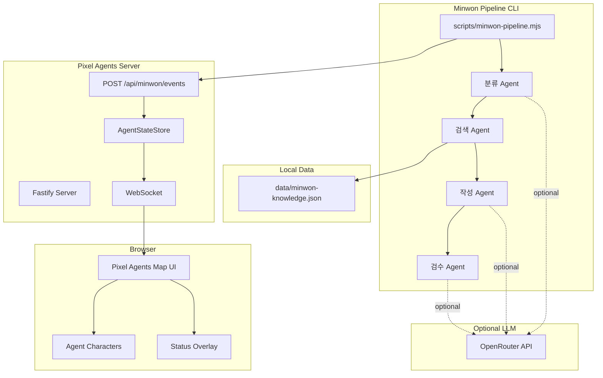

# 민원 처리 Multi-Agent Pixel Agents

> 공공 민원 처리 흐름을 **분류 → 근거 검색 → 답변 작성 → 검수**의 Multi-Agent 협업 구조로 모델링하고, 기존 **Pixel Agents UI**에서 각 Agent의 진행 상태를 시각화하는 프로토타입입니다.


<p align="center">
  
</p>

<p align="center">
  <b>Pixel Agents 원본 맵 UI 위에서 분류·검색·작성·검수 Agent가 순차적으로 민원 처리 상태를 표시하는 화면</b>
</p>

이 프로젝트는 민원 1건을 입력받아 4개의 Agent가 순차적으로 처리하는 구조를 구현합니다.

- **분류 Agent**: 민원 유형, 핵심 쟁점, 긴급도, 처리 방향 분석
- **검색 Agent**: 로컬 지식베이스에서 관련 법령·유사 사례 검색
- **작성 Agent**: 민원 답변 초안 작성
- **검수 Agent**: 답변의 표현, 근거, 과도한 단정 여부 검토

별도의 정적 데모 화면을 만든 것이 아니라, 기존 Pixel Agents의 **맵, 캐릭터, WebSocket, AgentStateStore** 구조를 유지했습니다.
민원 파이프라인은 `/api/minwon/events` endpoint로 이벤트를 보내고, 브라우저에서는 기존 Pixel Agents 화면에서 Agent들이 순차적으로 작업하는 모습을 확인할 수 있습니다.

LLM API Key가 없어도 `--no-llm` fallback 모드로 전체 흐름을 실행할 수 있습니다.

```bash
npm install
npm run build
node dist/cli.js --port 3100
```

새 터미널에서 실행:

```bash
node scripts/minwon-pipeline.mjs --sample 1 --no-llm
```

---

## 1. 프로젝트가 다루는 문제

공공 민원 처리 업무는 단순히 답변 문장을 생성하는 문제가 아닙니다.
실제 처리 과정은 보통 다음과 같은 여러 단계로 나뉩니다.

1. 민원 내용 파악
2. 소관 유형과 긴급도 판단
3. 관련 법령·내부 기준·유사 사례 확인
4. 답변 초안 작성
5. 표현, 근거, 책임 범위 검토
6. 최종 답변 정리

이 프로젝트는 이 흐름을 하나의 거대한 AI 호출로 처리하지 않고, 역할이 분리된 여러 Agent의 협업 구조로 나누어 표현합니다.
또한 각 Agent가 어떤 단계에서 어떤 작업을 수행하는지 Pixel Agents 화면에서 시각적으로 확인할 수 있도록 구성했습니다.

---

## 2. 핵심 아이디어

이 저장소의 핵심은 다음 두 가지입니다.

### 2.1 민원 처리 과정을 Agent 협업 구조로 분리

민원 1건을 다음 4단계로 처리합니다.

```text
입력 민원
→ 분류 Agent
→ 검색 Agent
→ 작성 Agent
→ 검수 Agent
→ JSON / Markdown 결과 저장
```

각 Agent는 독립된 역할을 가지며, 앞 단계의 결과를 다음 단계의 입력으로 사용합니다.

### 2.2 기존 Pixel Agents UI에 이벤트를 주입

새로운 정적 화면을 만들지 않고, 기존 Pixel Agents 서버에 작은 이벤트 수신 endpoint를 추가했습니다.

```text
민원 파이프라인
→ /api/minwon/events
→ AgentStateStore
→ WebSocket
→ Browser Pixel Agents UI
```

따라서 기존 Pixel Agents의 캐릭터, 맵, WebSocket 기반 상태 표시 구조를 그대로 활용합니다.

---

## 3. 전체 동작 흐름

```mermaid
flowchart LR
    A[입력 민원] --> B[분류 Agent<br/>민원 분석 중]
    B --> C[검색 Agent<br/>근거 검색 중]
    C --> D[작성 Agent<br/>답변 초안 작성 중]
    D --> E[검수 Agent<br/>답변 검수 중]
    E --> F[JSON 결과 저장]
    E --> G[Markdown 결과 저장]

    B -. 상태 이벤트 .-> H[/api/minwon/events]
    C -. 상태 이벤트 .-> H
    D -. 상태 이벤트 .-> H
    E -. 상태 이벤트 .-> H

    H --> I[AgentStateStore]
    I --> J[WebSocket Broadcast]
    J --> K[Pixel Agents Browser UI]
```

---

## 4. 시스템 구조



---

## 5. Agent 구성

| Agent      | 역할                                         | 입력                            | 출력                   | 화면 표시 상태    |
| ---------- | -------------------------------------------- | ------------------------------- | ---------------------- | ----------------- |
| 분류 Agent | 민원 유형, 핵심 쟁점, 긴급도, 처리 방향 분류 | 민원 원문                       | 분류 결과 JSON         | 민원 분석 중      |
| 검색 Agent | 로컬 지식베이스에서 관련 법령·사례 검색      | 민원 원문, 분류 결과            | 관련 법령·사례 목록    | 근거 검색 중      |
| 작성 Agent | 민원 답변 초안 작성                          | 민원 원문, 분류 결과, 검색 근거 | 답변 초안              | 답변 초안 작성 중 |
| 검수 Agent | 답변 표현, 근거, 단정 여부 검토              | 초안, 근거, 분류 결과           | 최종 답변 및 검수 의견 | 답변 검수 중      |

---

## 6. 실행 모드

| 모드                 | 설명                                             | 명령어                                                              |
| -------------------- | ------------------------------------------------ | ------------------------------------------------------------------- |
| OpenRouter 호출 모드 | `.env`에 API Key를 설정하고 실제 LLM을 호출      | `node scripts/minwon-pipeline.mjs --sample 1`                       |
| fallback 모드        | API Key 없이 규칙 기반 분류·템플릿 답변으로 실행 | `node scripts/minwon-pipeline.mjs --sample 1 --no-llm`              |
| 직접 입력 모드       | 샘플 대신 직접 민원 문장을 입력                  | `node scripts/minwon-pipeline.mjs --text "민원 내용"`               |
| 화면 지연 조절       | Agent 상태 표시 시간을 조절                      | `node scripts/minwon-pipeline.mjs --sample 1 --pixel-delay-ms 1500` |

---

## 7. 빠른 시작

### 7.1 macOS / Linux / Git Bash

```bash
npm install
npm run build
node dist/cli.js --port 3100
```

브라우저에서 접속합니다.

```text
http://127.0.0.1:3100
```

새 터미널에서 민원 파이프라인을 실행합니다.

```bash
node scripts/minwon-pipeline.mjs --sample 1 --no-llm
```

### 7.2 Windows PowerShell

```powershell
npm install
npm run build
node dist\cli.js --port 3100
```

브라우저에서 접속합니다.

```text
http://127.0.0.1:3100
```

새 PowerShell 창에서 실행합니다.

```powershell
node scripts\minwon-pipeline.mjs --sample 1 --no-llm
```

---

## 8. 설치 방법

### 8.1 저장소 클론

```bash
git clone https://github.com/byeonghak-kim/minwon-pixel-agents.git
cd minwon-pixel-agents
```

### 8.2 패키지 설치

```bash
npm install
```

### 8.3 빌드

```bash
npm run build
```

빌드가 완료되면 Pixel Agents 서버와 민원 파이프라인을 실행할 수 있습니다.

---

## 9. 환경변수 설정

OpenRouter API를 사용하려면 `.env.example`을 복사해 `.env` 파일을 만듭니다.

### macOS / Linux / Git Bash

```bash
cp .env.example .env
```

### Windows PowerShell

```powershell
Copy-Item .env.example .env
```

`.env` 파일에 OpenRouter API Key를 입력합니다.

```env
OPENROUTER_API_KEY=your_openrouter_api_key_here
OPENROUTER_MODEL_CLASSIFY=google/gemini-2.5-flash-lite
OPENROUTER_MODEL_WRITE=google/gemini-2.5-flash
OPENROUTER_MODEL_REVIEW=google/gemini-2.5-flash-lite
```

`.env` 파일은 GitHub에 업로드하지 않습니다.
이 저장소의 `.gitignore`에는 `.env`, `.env.*`가 포함되어 있고, 예시 파일인 `.env.example`만 추적됩니다.

---

## 10. 실행 방법

### 10.1 Pixel Agents 서버 실행

먼저 Pixel Agents 서버를 실행합니다.

#### macOS / Linux / Git Bash

```bash
node dist/cli.js --port 3100
```

#### Windows PowerShell

```powershell
node dist\cli.js --port 3100
```

정상 실행 후 브라우저에서 아래 주소로 접속합니다.

```text
http://127.0.0.1:3100
```

Pixel Agents 맵 화면이 보이면 준비가 완료된 것입니다.

---

### 10.2 민원 파이프라인 실행

새 터미널을 열고 다음 명령을 실행합니다.

#### macOS / Linux / Git Bash

```bash
node scripts/minwon-pipeline.mjs --sample 1
```

#### Windows PowerShell

```powershell
node scripts\minwon-pipeline.mjs --sample 1
```

실행 중 브라우저의 Pixel Agents 화면에서 4개 Agent가 순서대로 작업 상태를 표시합니다.

```text
분류 Agent → 검색 Agent → 작성 Agent → 검수 Agent
```

---

## 11. 샘플 민원 실행

`data/minwon-knowledge.json`에는 3개의 샘플 민원이 포함되어 있습니다.

### 11.1 도로 파손 및 차량 손상 민원

```bash
node scripts/minwon-pipeline.mjs --sample 1
```

입력 예시:

```text
도로 파손으로 차량이 손상되었습니다. 보상과 긴급 보수를 요청합니다.
```

### 11.2 공사 소음 민원

```bash
node scripts/minwon-pipeline.mjs --sample 2
```

입력 예시:

```text
아파트 앞 공사장에서 밤늦게까지 소음이 심합니다. 점검과 조치를 요청합니다.
```

### 11.3 쓰레기 무단투기 민원

```bash
node scripts/minwon-pipeline.mjs --sample 3
```

입력 예시:

```text
골목에 쓰레기 무단투기가 반복되고 악취가 심합니다. 단속과 청소를 요청합니다.
```

---

## 12. 직접 민원 입력 실행

`--text` 옵션을 사용하면 샘플이 아닌 임의의 민원 문장을 입력할 수 있습니다.

### macOS / Linux / Git Bash

```bash
node scripts/minwon-pipeline.mjs --text "도로 파손으로 차량이 손상되었습니다. 보상과 긴급 보수를 요청합니다."
```

### Windows PowerShell

```powershell
node scripts\minwon-pipeline.mjs --text "도로 파손으로 차량이 손상되었습니다. 보상과 긴급 보수를 요청합니다."
```

---

## 13. LLM 없이 실행하기

OpenRouter API Key가 없거나, 우선 화면 연동과 전체 흐름만 확인하고 싶다면 `--no-llm` 옵션을 사용합니다.

```bash
node scripts/minwon-pipeline.mjs --sample 1 --no-llm
```

fallback 모드에서는 다음 방식으로 동작합니다.

- 분류: 규칙 기반 keyword 분류
- 검색: 로컬 JSON 지식베이스 keyword score
- 작성: 템플릿 기반 답변 초안
- 검수: 규칙 기반 검수 의견

이 모드에서도 Pixel Agents 화면 연동, Agent 순차 상태 표시, 결과 파일 저장은 동일하게 동작합니다.

---

## 14. 화면 표시 시간 조절

Agent 상태가 너무 빠르게 지나가면 `--pixel-delay-ms` 옵션으로 화면 표시 시간을 늘릴 수 있습니다.

```bash
node scripts/minwon-pipeline.mjs --sample 1 --pixel-delay-ms 1500
```

값은 millisecond 단위입니다.

예시:

|     값 | 의미                             |
| -----: | -------------------------------- |
|  `700` | 기본값에 가까운 빠른 표시        |
| `1500` | 상태 변화를 눈으로 확인하기 쉬움 |
| `3000` | 발표·시연용으로 여유 있게 표시   |

---

## 15. 실행 결과 확인

파이프라인 실행이 끝나면 `runs/` 폴더에 결과 파일이 생성됩니다.

```text
runs/minwon-run-YYYYMMDD-HHMMSS.json
runs/minwon-run-YYYYMMDD-HHMMSS.md
```

### JSON 결과

전체 처리 데이터를 구조화된 형태로 저장합니다.

포함 내용:

- 실행 시각
- 실행 모드
- Pixel Agents 연동 여부
- 입력 민원
- 분류 결과
- 검색 근거
- 답변 초안
- 검수 결과
- 최종 답변

### Markdown 결과

사람이 읽기 쉬운 보고서 형태로 저장합니다.

포함 내용:

- 입력 민원
- 분류 Agent 결과
- 검색 Agent 결과
- 작성 Agent 초안
- 검수 Agent 의견
- 최종 답변

실행 결과 파일은 `.gitignore`에 의해 Git 추적 대상에서 제외됩니다.

---

## 16. 프로젝트 구조

```text
.
├─ data/
│  └─ minwon-knowledge.json
│
├─ runs/
│  └─ .gitkeep
│
├─ scripts/
│  ├─ minwon-pipeline.mjs
│  ├─ openrouter-client.mjs
│  └─ lib/
│     └─ openrouter-client.mjs
│
├─ server/
│  └─ src/
│     └─ httpServer.ts
│
├─ .env.example
├─ .gitignore
└─ README.md
```

---

## 17. 주요 파일 설명

| 파일                                | 설명                                              |
| ----------------------------------- | ------------------------------------------------- |
| `data/minwon-knowledge.json`        | 법령, 유사 사례, 샘플 민원을 담은 로컬 지식베이스 |
| `scripts/minwon-pipeline.mjs`       | 민원 처리 Multi-Agent 파이프라인 실행 스크립트    |
| `scripts/lib/openrouter-client.mjs` | OpenRouter API 호출 공통 모듈                     |
| `scripts/openrouter-client.mjs`     | OpenRouter 단독 호출 테스트용 CLI                 |
| `server/src/httpServer.ts`          | Pixel Agents 서버에 민원 이벤트 endpoint 추가     |
| `runs/.gitkeep`                     | 실행 결과 폴더 유지용 파일                        |
| `.env.example`                      | 환경변수 예시 파일                                |
| `.gitignore`                        | 민감정보와 실행 결과 파일 제외 설정               |

---

## 18. 주요 구현 포인트

### 18.1 `/api/minwon/events` endpoint 추가

`server/src/httpServer.ts`에 다음 endpoint를 추가했습니다.

```text
POST /api/minwon/events
```

이 endpoint는 기존 Pixel Agents 서버의 Bearer token 인증을 사용합니다.

민원 파이프라인은 다음 이벤트를 전송합니다.

| 이벤트            | 역할                                     |
| ----------------- | ---------------------------------------- |
| `agentCreated`    | 민원 처리 Agent를 AgentStateStore에 등록 |
| `agentSelected`   | 현재 작업 중인 Agent 선택                |
| `agentToolStart`  | Agent 작업 시작 상태 표시                |
| `agentToolDone`   | Agent 작업 완료 이벤트 전달              |
| `agentToolsClear` | Agent 작업 상태 초기화                   |
| `agentStatus`     | Agent 상태를 idle 등으로 갱신            |

### 18.2 기존 Pixel Agents UI 유지

이 프로젝트는 원본 Pixel Agents 화면을 대체하지 않습니다.
민원 처리 기능은 기존 서버와 UI 위에 이벤트 주입 경로를 추가하는 방식으로 동작합니다.

유지되는 구조:

- 기존 맵 렌더링
- 기존 캐릭터 표시
- 기존 WebSocket 연결
- 기존 hook route
- 기존 Agent 상태 표시 방식

### 18.3 UTF-8 기반 이벤트 송신

한글 상태 메시지가 깨지지 않도록 민원 파이프라인에서 JSON payload를 UTF-8 byte buffer로 전송합니다.

```js
const body = Buffer.from(JSON.stringify(payload), 'utf8');
```

이를 통해 `민원 분석 중`, `근거 검색 중`, `답변 초안 작성 중`, `답변 검수 중` 같은 한글 상태가 정상적으로 표시됩니다.

### 18.4 로컬 지식베이스 검색

검색 Agent는 `data/minwon-knowledge.json`에 정의된 법령·사례 데이터를 대상으로 keyword score를 계산합니다.

```text
입력 민원 + 분류 결과 + 핵심 쟁점
→ keyword score 계산
→ 관련 법령 상위 3개
→ 유사 사례 상위 3개
```

---

## 19. OpenRouter 단독 테스트

OpenRouter 연결만 별도로 확인하려면 다음 CLI를 사용할 수 있습니다.

### macOS / Linux / Git Bash

```bash
node scripts/openrouter-client.mjs "안녕. 한 문장으로 답해줘."
```

### Windows PowerShell

```powershell
node scripts\openrouter-client.mjs "안녕. 한 문장으로 답해줘."
```

PowerShell 파이프 입력도 가능합니다.

```powershell
"안녕. 한 문장으로 답해줘." | node scripts\openrouter-client.mjs
```

---

## 20. 스크린샷 추가 방법

현재 README는 Mermaid 다이어그램을 중심으로 프로젝트 구조를 설명합니다.
실제 실행 화면을 추가하려면 `docs/images/` 폴더를 만들고 이미지 파일을 넣은 뒤 README에 아래 형식으로 추가하면 됩니다.

```markdown

```

권장 캡처 장면:

1. Pixel Agents 맵 화면에 4개 Agent가 표시된 모습
2. 분류 Agent가 “민원 분석 중” 상태인 모습
3. 검수 Agent까지 완료된 뒤 콘솔에 최종 답변이 출력된 모습
4. `runs/` 폴더에 Markdown 결과가 생성된 모습

---

## 21. 문제 해결

### 21.1 Pixel Agents 화면이 열리지 않는 경우

먼저 서버가 실행 중인지 확인합니다.

```bash
node dist/cli.js --port 3100
```

Windows PowerShell에서는 다음 명령을 사용합니다.

```powershell
node dist\cli.js --port 3100
```

이후 브라우저에서 접속합니다.

```text
http://127.0.0.1:3100
```

---

### 21.2 파이프라인은 실행되는데 화면에 Agent가 안 보이는 경우

Pixel Agents 서버가 먼저 실행되어 있어야 합니다.

올바른 순서:

```text
1. Pixel Agents 서버 실행
2. 브라우저에서 http://127.0.0.1:3100 접속
3. 새 터미널에서 민원 파이프라인 실행
```

서버 실행 전에 파이프라인을 먼저 실행하면 화면 이벤트가 전달되지 않을 수 있습니다.

---

### 21.3 OpenRouter API 오류가 나는 경우

`.env` 파일에 API Key가 설정되어 있는지 확인합니다.

```env
OPENROUTER_API_KEY=your_openrouter_api_key_here
```

API Key 없이 동작 확인만 하려면 fallback 모드를 사용합니다.

```bash
node scripts/minwon-pipeline.mjs --sample 1 --no-llm
```

---

### 21.4 `.env` 파일이 없는 경우

`.env.example`을 복사해 `.env` 파일을 생성합니다.

#### macOS / Linux / Git Bash

```bash
cp .env.example .env
```

#### Windows PowerShell

```powershell
Copy-Item .env.example .env
```

그 후 `.env`에 OpenRouter API Key를 입력합니다.

---

### 21.5 `runs/` 결과 파일이 GitHub에 보이지 않는 경우

정상입니다.

`runs/minwon-run-*.json`, `runs/minwon-run-*.md`는 실행할 때마다 생성되는 runtime output입니다.
따라서 `.gitignore`에 의해 GitHub에는 올라가지 않습니다.

```gitignore
runs/*.json
runs/*.md
!runs/.gitkeep
```

GitHub에는 `runs/.gitkeep`만 유지됩니다.

---

### 21.6 Windows PowerShell에서 경로 오류가 나는 경우

Windows PowerShell에서는 보통 `\` 경로 구분자를 사용합니다.

예:

```powershell
node dist\cli.js --port 3100
node scripts\minwon-pipeline.mjs --sample 1
```

macOS, Linux, Git Bash에서는 `/`를 사용합니다.

```bash
node dist/cli.js --port 3100
node scripts/minwon-pipeline.mjs --sample 1
```

---

## 22. 보안 및 Git 관리

이 저장소는 민감정보와 실행 결과 파일이 GitHub에 올라가지 않도록 `.gitignore`를 구성합니다.

제외 대상:

```gitignore
.env
.env.*
runs/*.json
runs/*.md
```

허용 대상:

```gitignore
!.env.example
!runs/.gitkeep
```

주의할 점:

- 실제 OpenRouter API Key는 `.env`에만 저장합니다.
- `.env`는 GitHub에 업로드하지 않습니다.
- 실행 결과 파일은 `runs/`에 생성되지만 Git 추적 대상에서 제외됩니다.
- 공개 저장소에 API Key, token, 개인 인증정보를 커밋하지 않습니다.

---

## 23. 활용 가능성

이 프로젝트는 다음과 같은 목적에 활용할 수 있습니다.

- 공공 민원 처리 자동화 흐름 프로토타입
- AI Agent 협업 구조 시각화
- 생성형 AI 기반 답변 초안 작성 실험
- RAG 기반 행정업무 보조 시스템 구조 검토
- 비전공자에게 Multi-Agent 처리 흐름을 설명하기 위한 시각적 데모
- 기존 UI 시스템에 AI pipeline event를 연결하는 방식의 참고 구현

---

## 24. 참고 및 라이선스

이 저장소는 Pixel Agents 프로젝트를 기반으로 민원 처리 Multi-Agent 파이프라인을 연동한 확장 구현입니다.

원본 Pixel Agents의 서버, WebSocket, UI 구조를 유지하면서 다음 기능을 추가했습니다.

- 민원 처리 pipeline script
- OpenRouter 연동 모듈
- 로컬 민원 지식베이스
- `/api/minwon/events` endpoint
- Agent 상태 이벤트 송신
- JSON / Markdown 실행 결과 저장

원본 프로젝트의 라이선스와 사용 조건을 함께 확인해야 합니다.
